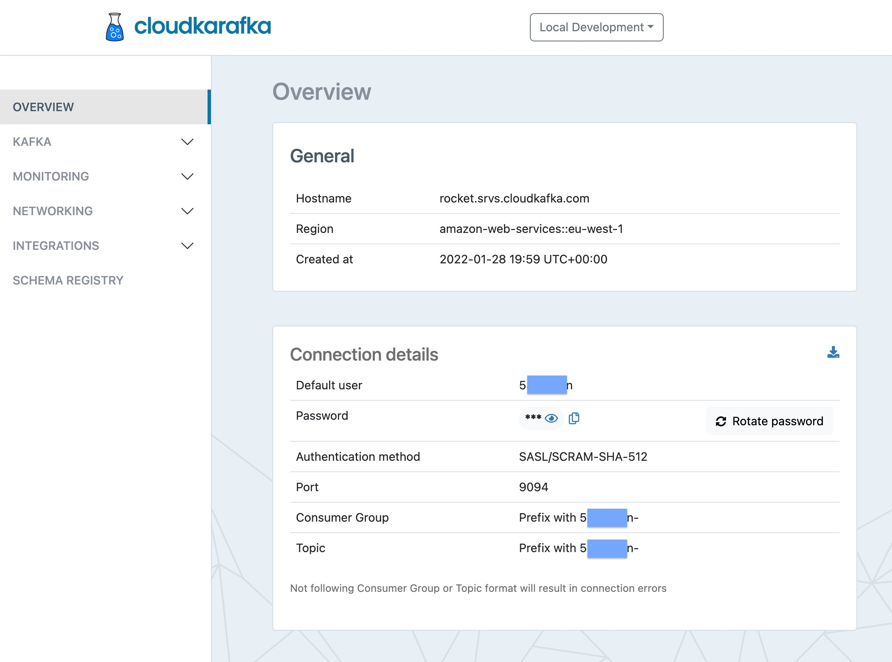
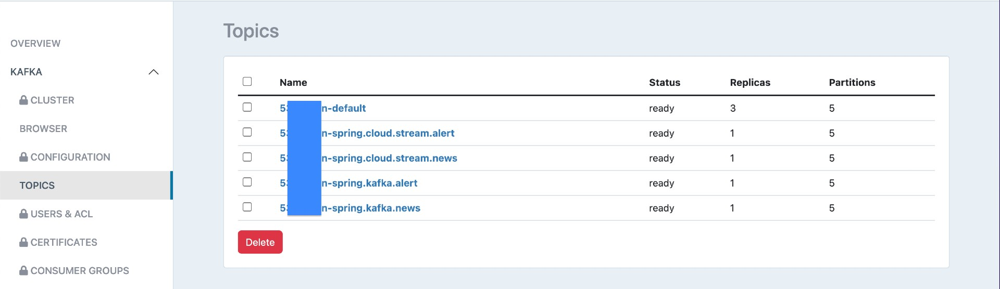

# spring-cloud-stream-kafka-multi-topics-cloudkarafka

The goal of this project is to implement a [`Spring Boot`](https://docs.spring.io/spring-boot/docs/current/reference/htmlsingle/) application that _produces_ messages to a [`Kafka`](https://kafka.apache.org/) topic and another `Spring Boot` application that _consumes_ these messages.

Similar projects are: [`spring-kafka-de-serialization-types`](https://github.com/ivangfr/spring-kafka-de-serialization-types) and [`spring-cloud-stream-kafka-elasticsearch`](https://github.com/ivangfr/spring-cloud-stream-kafka-elasticsearch).

However, in this one, when the Spring Profile `cloudkarafka` is used, `producer` and `consumer` will connect to a `Kafka` that is located in a cloud-based messaging service called [`CloudKarafka`](https://www.cloudkarafka.com/). When running the applications with `default` profile, `producer` and `consumer` will connect to `Kafka` that is running locally in a `Docker` container.

## Proof-of-Concepts & Articles

On [ivangfr.github.io](https://ivangfr.github.io), I have compiled my Proof-of-Concepts (PoCs) and articles. You can easily search for the technology you are interested in by using the filter. Who knows, perhaps I have already implemented a PoC or written an article about what you are looking for.

## Examples

- ### [spring-kafka](https://github.com/ivangfr/spring-cloud-stream-kafka-multi-topics-cloudkarafka/tree/master/spring-kafka#spring-cloud-stream-kafka-multi-topics-cloudkarafka)
- ### [spring-cloud-stream](https://github.com/ivangfr/spring-cloud-stream-kafka-multi-topics-cloudkarafka/tree/master/spring-cloud-stream#spring-cloud-stream-kafka-multi-topics-cloudkarafka)

## Prerequisites

- [`Java 17+`](https://www.oracle.com/java/technologies/downloads/#java17)
- [`Docker`](https://www.docker.com/)

## Using CloudKarafka

### Configuration

- Access [`CloudKarafka`](https://www.cloudkarafka.com/) website

- Create a free account.

- Follow this [documentation](https://www.cloudkarafka.com/docs/index.html) on how to get started.

- Here is the overview of my `Local Development` instance

  

- In order to get information about the topics, on the left-menu, select KAFKA > TOPICS

  

- You can use the topic with suffix `default` or create new ones. In my case, I created four:
  - for `spring-kafka` applications, one with suffix `spring.kafka.news` and another with suffix `spring.kafka.alert`;
  - for `spring-cloud-stream` applications, one with suffix `spring.cloud.stream.news` and another with suffix `spring.cloud.stream.alert`.

## Using Kafka running locally

### Start Environment

- Open a terminal and inside `spring-cloud-stream-kafka-multi-topics-cloudkarafka` root folder run
  ```
  docker compose up -d
  ```

- Wait for Docker containers to be up and running. To check it, run
  ```
  docker compose ps
  ```

- Create the Kafka topics used by the applications
  ```
  ./create-kafka-topics.sh
  ```

### Useful Links

- **Kafdrop**

  `Kafdrop` can be accessed at http://localhost:9000

### Shutdown

To stop and remove docker compose containers, network and volumes, go to a terminal and, inside `spring-cloud-stream-kafka-multi-topics-cloudkarafka`, run the command below
```
docker compose down -v
```

## Cleanup

To remove the Docker images created by this project, go to a terminal and, inside `spring-cloud-stream-kafka-multi-topics-cloudkarafka` root folder, run the following script
```
./remove-docker-images.sh
```

## References

- https://docs.spring.io/spring-kafka/reference/html/
- https://docs.spring.io/spring-cloud-stream/docs/current/reference/html/spring-cloud-stream.html